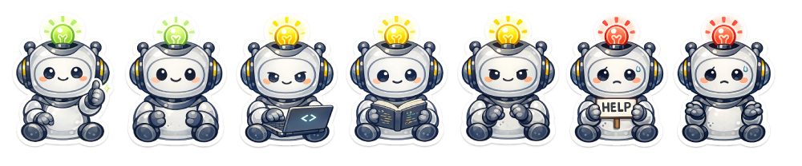

# Agent Paperclip


A desktop companion that lets you monitor your AI coding agent. See when the agent is done, when it needs input, and how much context has been used without having to stare at your terminal. Also, it's cute.


## Installation

### Prerequisites

- Node.js 18+
- Claude Code CLI and/or Codex CLI

### Option 1: npm (recommended)

```bash
npm install -g agent-paperclip
```

After installing, configure the Claude Code hooks:

```bash
agent-paperclip setup
```

Then launch the app:

```bash
agent-paperclip
```

To stop: run `agent-paperclip stop`, use Cmd+Q, or quit from the dock.

Codex support is automatic -- if `~/.codex/` exists, a background watcher picks up Codex sessions with no extra setup.

### Option 2: From source

1. Clone and install:
   ```bash
   git clone https://github.com/fredruss/agent-paperclip
   cd agent-paperclip
   npm install
   ```
   This installs dependencies and prompts to configure Claude Code hooks. Type `y` to allow.

2. Run the app:
   ```bash
   npm run dev
   ```

## Usage

The pet window will appear and float on top of other windows. It automatically updates based on what the agent is doing:

- **Thinking** - The agent is reasoning or responding
- **Reading** - Reading files or searching code
- **Working** - Writing, editing, or running commands
- **Waiting** - Needs your permission or has a question
- **Idle** - Waiting for input
- **Done** - Finished a task
- **Error** - Something went wrong

The pet also displays the context window usage (input + cache tokens from the latest API call).



### Controls

- **Drag** - Click and drag the pet to move it around your screen
- **Right-click** - Change sticker pack (2 packs currently available + basic SVG pack)

## How It Works

The companion supports two agents via different mechanisms:

**Claude Code** uses the hook system to receive real-time events:

```
Claude Code --[hooks]--> status-reporter.js --> status.json <--[watching]-- Desktop Pet (Electron)
```

**Codex CLI** is monitored passively by tailing its session rollout files:

```
Codex CLI --> ~/.codex/sessions/*.jsonl <--[tailing]-- codex-watcher --> status.json <--[watching]-- Desktop Pet
```

Both write to the same `~/.agent-paperclip/status.json`, so the pet reflects whichever agent is currently active.

## Privacy

The companion displays status information from `~/.agent-paperclip/status.json`.

**What IS captured in status.json:**
- **Tool names** - Read, Write, Bash, Grep, etc.
- **Filenames** - Names of files being read, written, or edited (e.g., `Reading index.ts...`)
- **Command names** - First word of bash commands (e.g., `Running npm...`)
- **Search patterns** - Grep patterns, truncated to 20 characters (e.g., `Searching for "pattern"...`)
- **Thinking snippets** - Brief excerpts of agent reasoning, truncated to ~40 characters
- **Token counts** - Current context window usage

**What is NOT captured:**
- Agent responses to you (only internal "thinking" blocks are read)
- Your prompts or questions
- File contents or code
- Full bash commands (only the first word)

All data stays local on your machine and is never sent anywhere.

### Transcript Data

For Claude Code, token counts and thinking snippets are extracted from the transcript file (`~/.claude/projects/.../session.jsonl`), not from hook events. For Codex, they come from the session rollout JSONL files in `~/.codex/sessions/`.

## Building from Source

To build distributable installers for your platform:

```bash
cd app
npm run dist        # Build for current platform
npm run dist:mac    # macOS .dmg
npm run dist:win    # Windows .exe
npm run dist:linux  # Linux .AppImage
```

Output goes to `app/dist/`.

Note: macOS builds will show a security warning unless code-signed with an Apple Developer certificate.

## Troubleshooting

### Pet doesn't update when using Claude Code

Check that the hooks are configured in `~/.claude/settings.json`:

```bash
cat ~/.claude/settings.json | grep agent-paperclip
```

If hooks are missing, run `agent-paperclip setup` to configure them.

### Pet doesn't update when using Codex

Make sure `~/.codex/` exists (created automatically when Codex CLI is first used). The companion will detect it on launch and start watching for sessions.

### Pet window doesn't appear

On macOS, you may need to allow the app in System Preferences > Security & Privacy.

## License

MIT
